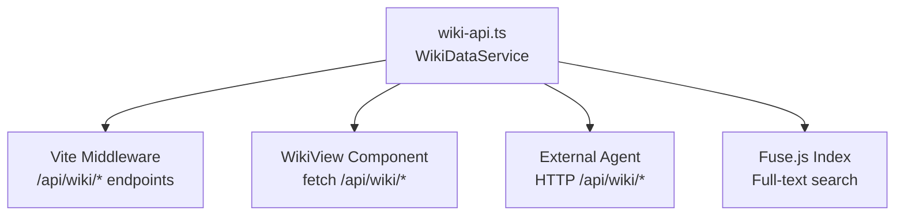

# /understand-wiki 剩余工作完整提案

> Date: 2026-06-03
> Status: DRAFT — 待审批

## 背景

PRD (`team-knowledge-base.prd.md`) 定义了 5 个 Delivery Milestones。当前进度：

| # | Milestone | 完成度 | 缺失项 |
|---|---|---|---|
| 1 | wiki-worker + wiki-reviewer agent | 100% | — |
| 2 | /understand-wiki 主流程编排 | 100% | — |
| 3 | 跨服务代码结构聚合 | 95% | 父级 Wiki schema 缺少验证函数 |
| 4 | Dashboard Wiki 视图 | 70% | 多服务导航、跨服务跳转、源码关联、视图切换 |
| 5 | Agent Query API | 0% | 完全未实现 |

## 架构决策

**选择 Option C：共享数据层 + 双消费端**



- 创建独立 `wiki-api.ts` 模块封装所有 Wiki 数据访问逻辑
- Dashboard WikiView 通过 `/api/wiki/*` 端点消费数据
- 外部 Agent 使用相同 API 端点
- 避免文件读取逻辑重复

---

## Sprint 1：Agent Query API + Wiki Data Layer (M5)

### 1.1 WikiDataService (`packages/dashboard/wiki-api.ts`)

核心类，封装 Wiki 文件系统读取和索引构建：

```typescript
interface WikiDataService {
  // 发现所有可用的 Wiki（parent + per-service）
  discoverWikis(): WikiTopology;
  
  // API methods mapping to PRD endpoints
  getGlobalIndex(): WikiGlobalIndex;
  getOverview(): WikiOverview | null;
  getArchitecture(): WikiArchitecture | null;
  getServices(): WikiServiceList;
  getServiceWiki(serviceName: string): WikiServiceIndex | null;
  getDomain(domainName: string): WikiCrossDomain | null;
  getServiceDomain(serviceName: string, domainId: string): WikiDomainPage | null;
  search(query: string): WikiSearchResult[];
  getRelated(pageId: string): WikiRelatedPages;
}

interface WikiTopology {
  hasParentWiki: boolean;
  parentWikiDir: string | null;
  services: Array<{
    name: string;
    wikiDir: string;
    meta: WikiMeta;
  }>;
}
```

**多服务发现逻辑：**
1. 从 projectRoot 检查 `.understand-anything/wiki/meta.json`（parent wiki）
2. 扫描 projectRoot 下所有子目录，找到有 `.understand-anything/wiki/meta.json` 的服务
3. 缓存拓扑结构，文件变更时重建

**搜索实现：**
- 启动时加载所有 Wiki 页面的 `name`、`summary`、`content` 字段
- 使用 Fuse.js 构建索引（复用 `@understand-anything/core/search` 现有模式）
- 搜索返回：匹配页面 ID、类型、服务归属、相关度评分、匹配片段

### 1.2 API 端点 (`vite.config.ts` 扩展)

在现有 Vite middleware 中添加 `/api/wiki/*` 路由：

| Endpoint | Handler | 返回 |
|---|---|---|
| `GET /api/wiki` | `getGlobalIndex()` | 全局索引（所有服务+所有域概要） |
| `GET /api/wiki/overview` | `getOverview()` | 系统总览页 JSON |
| `GET /api/wiki/architecture` | `getArchitecture()` | 跨服务架构页 JSON |
| `GET /api/wiki/services` | `getServices()` | 服务列表及概要 |
| `GET /api/wiki/service/:name` | `getServiceWiki(name)` | 指定服务的 Wiki 索引 |
| `GET /api/wiki/domain/:name` | `getDomain(name)` | 跨服务业务域编排页 |
| `GET /api/wiki/service/:name/domain/:d` | `getServiceDomain(name, d)` | 服务内业务域详情 |
| `GET /api/wiki/search?q=xxx` | `search(q)` | 全文搜索结果 |
| `GET /api/wiki/:id/related` | `getRelated(id)` | 关联页面和源码节点 |

所有端点共享 ACCESS_TOKEN 鉴权（已有机制复用）。

### 1.3 测试

- 单元测试：WikiDataService 各方法（mock 文件系统）
- 集成测试：确保 API 端点正确响应

---

## Sprint 2：增强 Dashboard Wiki View (M4 核心)

### 2.1 双轴导航树设计

当前 `WikiNavTree` 只支持单服务 flat list。重构为**双轴导航**（Domain-centric + Service-centric）：

**设计原则：两个正交视角，双向关联跳转。**

```
📖 System Overview                        ← parent overview.json
🏗️ Architecture                           ← parent architecture.json

── 📂 By Domain (业务域视角) ──
  ├── 🌐 Order Management                ← parent domains/order-mgmt.json
  │   ├── E2E Flow: Order Creation
  │   └── Involved Services:
  │       ├── → order-service (link)
  │       ├── → payment-service (link)
  │       └── → inventory-service (link)
  └── 🌐 Payment
      ├── E2E Flow: Payment Processing
      └── Involved Services:
          ├── → payment-service (link)
          └── → order-service (link)

── 📦 By Service (服务视角) ──
  ├── 📦 order-service
  │   ├── Service Overview (职责/技术栈/模块)
  │   ├── Participates in: [Order Management], [Payment]  ← 交叉引用到域视角
  │   └── Internal Domains:
  │       ├── order-management (detailed)
  │       └── shipping (detailed)
  ├── 📦 payment-service
  │   ├── Service Overview
  │   ├── Participates in: [Payment], [Order Management]
  │   └── Internal Domains:
  │       └── payment-processing
  └── 📦 inventory-service
      └── ...
```

**双向关联：**
- **Domain → Service**: 域页面列出涉及的服务，点击跳转到 Service 视角的详情
- **Service → Domain**: 服务概览列出参与的跨服务域，点击跳转到 Domain 视角的 E2E 编排

**数据来源映射：**
| 树节点 | 数据文件 |
|---|---|
| System Overview | parent `overview.json` |
| Architecture | parent `architecture.json` |
| By Domain 各项 | parent `domains/<cross-domain>.json` |
| By Service 各服务 | 各服务 `wiki/service.json` + `wiki/index.json` |
| Internal Domains | 各服务 `wiki/domains/<slug>.json` |
| Participates in (交叉引用) | parent `architecture.json` 的 crossServiceCalls |

**单服务退化：** 当只有 1 个服务接入（无 parent wiki）时，树自动简化为：
```
📦 <service-name>
  ├── Service Overview
  └── Domains:
      ├── domain-a
      └── domain-b
```
这就是当前 WikiView 已实现的形态。当 2+ 服务接入后自动升级为完整双轴结构。

**状态管理扩展** (`store.ts`)：

```typescript
// 新增状态
wikiTopology: WikiTopology | null;        // 多服务拓扑
wikiViewScope: "global" | string;         // "global" or service name
wikiBreadcrumb: WikiBreadcrumbItem[];     // 导航路径
```

### 2.2 WikiView 数据获取重构

将当前 raw file fetch 替换为 API 调用：

```typescript
// Before (current)
fetch(`/wiki/index.json?token=${token}`)

// After (refactored)
fetch(`/api/wiki?token=${token}`)           // global index
fetch(`/api/wiki/service/${name}?token=${token}`)  // service index
```

### 2.3 Breadcrumb 组件

新增 `WikiBreadcrumb.tsx`：

```
System Overview > order-service > Order Management > Create Order Flow
```

点击任一层级可跳转到对应页面。

### 2.4 `wikiToMarkdown.ts` 扩展

新增转换函数：
- `overviewToMarkdown(data: WikiOverview): string`
- `architectureToMarkdown(data: WikiArchitecture): string`
- `crossDomainToMarkdown(data: WikiCrossDomain): string`

---

## Sprint 3：跨服务导航 + 源码关联 (M4 高级)

### 3.1 Wiki 内部链接渲染

新增 `WikiLinkRenderer.tsx`：ReactMarkdown 的自定义 `a` 标签组件。

**链接格式约定：**
- 跨服务引用：`wiki://<service>/domains/<domain>#flow:<flowId>`
- 源码引用：`source://<relativePath>#L<start>-L<end>`

**行为：**
- `wiki://` 链接 → 在 WikiView 内导航（更新 activePage + breadcrumb）
- `source://` 链接 → 打开 CodeViewer 侧面板（复用已有 lazy-loaded CodeViewer）

### 3.2 CodeViewer 集成

当前 CodeViewer 已存在（`components/CodeViewer.tsx`，lazy loaded）。需要：
- WikiView 中增加 source panel 的 show/hide 状态
- 点击 sourceRef → 调用 `/file-content.json?path=<path>&token=<token>` 获取代码
- 显示在 WikiView 右侧或浮层中

### 3.3 视图切换器

在 Wiki header 区域添加视图切换：
- **Global View**：显示完整多服务树（parent + all services）
- **Service View**：只显示当前选中服务的 Wiki
- 切换时保留 breadcrumb 上下文

---

## Sprint 4：M3 验证补全 (Minor)

### 4.1 Parent Wiki Schema 验证

扩展 `packages/core/src/wiki-schema.ts`：

```typescript
export function validateParentWikiOverview(data: unknown): ValidationResult;
export function validateParentWikiArchitecture(data: unknown): ValidationResult;
export function validateParentWikiCrossDomain(data: unknown): ValidationResult;
```

### 4.2 测试

- `packages/core/src/__tests__/wiki-parent-schema.test.ts`
- 验证 overview.json、architecture.json、cross-domain pages 的结构正确性

---

## 工作量估算

| Sprint | 新增/修改文件 | 估计代码量 | 依赖 |
|---|---|---|---|
| Sprint 1 (API) | 3 files | ~400 LOC | 无 |
| Sprint 2 (UI core) | 5 files | ~500 LOC | Sprint 1 |
| Sprint 3 (Advanced) | 3 files | ~300 LOC | Sprint 2 |
| Sprint 4 (Validation) | 2 files | ~100 LOC | 无 (可并行) |

**总计：~1300 LOC，4 个 Sprint**

---

## 风险与约束

| 风险 | 缓解措施 |
|---|---|
| 多服务 Wiki 文件散布在不同目录，discovery 逻辑复杂 | 复用现有 `graphFileCandidates` 模式 + 统一 projectRoot 解析 |
| 全文搜索加载大量 Wiki 内容可能导致内存压力 | 懒加载 + 分页 + 限制搜索结果数量 |
| 跨服务链接格式需要 wiki-worker 生成一致的引用 | 在 wiki-worker.md agent 定义中明确输出格式要求 |
| CodeViewer 集成可能增加 WikiView 复杂度 | 用 portal/modal 模式隔离，不嵌入 WikiView 内部 |

---

## PRD Status 更新建议

完成所有 Sprint 后，PRD Milestones 应更新为：

| # | Milestone | Status |
|---|---|---|
| 1 | wiki-worker + wiki-reviewer agent 定义 | ✅ done |
| 2 | /understand-wiki 主流程编排 | ✅ done |
| 3 | 跨服务代码结构聚合 | ✅ done |
| 4 | Dashboard Wiki 视图 | ✅ done |
| 5 | Agent Query API | ✅ done |
