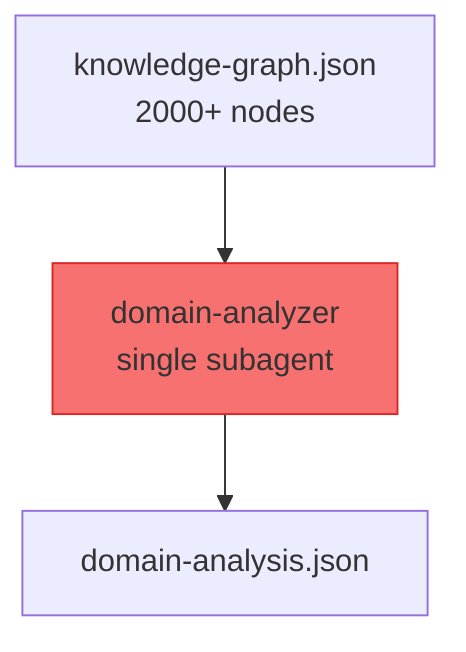
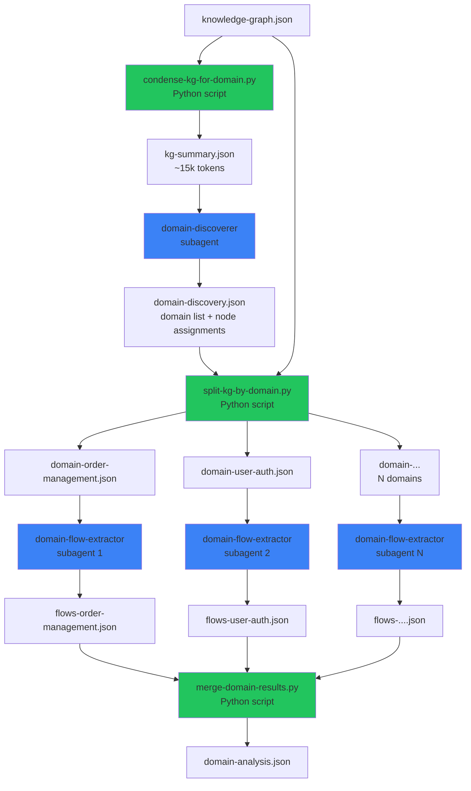

# Domain Analysis Split: Per-Domain Parallel Extraction

> Date: 2026-06-04
> Status: DRAFT — Pending approval

## Background

### Problem Statement

The `/understand-domain` skill's Phase 4 (Domain Analysis) dispatches a **single** `domain-analyzer` subagent that receives the full knowledge graph as context and must produce a complete domain graph in one pass.

For large codebases (2000+ KG nodes), this causes:

| Issue | Root Cause | Impact |
|---|---|---|
| Context overflow | Full KG = 100k+ tokens as input | Exceeds practical context limits |
| Timeout | Complex reasoning + large JSON output | >5 min, fails in Codex/Copilot |
| No failure isolation | Single monolithic task | Any error requires full retry |
| No parallelism | One subagent does everything | Slower than necessary |

**Observed failure (Codex):** `domain-analyzer` dispatched for `ultron-basic-user` did not complete within 5 minutes. Parent agent had to kill it and generate a manual fallback.

### Comparison with /understand

`/understand` solves the same scaling problem for code analysis by **batching**: Phase 2 dispatches N `file-analyzer` subagents (5 concurrent), each handling 5-10 files. This pattern is proven and reliable.

`/understand-domain` should follow the same pattern.

---

## Architecture

### Current Design (Single-Pass)



### Proposed Design (Split)



Green = deterministic Python scripts, Blue = LLM subagents.

---

## Component Design

### 1. `condense-kg-for-domain.py` (New Python Script)

**Purpose:** Reduce full KG to a module-level summary suitable for domain discovery.

**Input:** `knowledge-graph.json`

**Output:** `intermediate/kg-summary.json`

**Logic:**

```
1. Group nodes by top-level module (first significant directory segment)
2. Per module, aggregate:
   - Total node count by type (file, class, function, endpoint, service, ...)
   - Combined unique tags
   - Representative summaries (first 3 non-trivial summaries)
   - File list (names only)
3. Extract all endpoint/service/pipeline nodes in full (id, name, summary, tags)
4. Extract cross-module edges:
   - Group by (source_module, target_module, type)
   - Count per group
   - Keep up to 3 representative descriptions
5. Include layer assignments
6. Include project metadata
```

**Output schema:**

```json
{
  "project": { "name": "...", "languages": [...], "frameworks": [...] },
  "stats": { "totalNodes": 2000, "totalEdges": 5000 },
  "modules": [
    {
      "path": "src/order",
      "nodeCount": 120,
      "typeBreakdown": { "file": 30, "class": 20, "function": 60, "endpoint": 10 },
      "tags": ["order", "payment", "cart"],
      "summaries": ["Handles order creation and lifecycle", "..."],
      "files": ["OrderService.java", "OrderController.java", "..."]
    }
  ],
  "keyNodes": [
    { "id": "endpoint:...", "name": "POST /orders", "summary": "...", "tags": [...], "module": "src/order" }
  ],
  "crossModuleEdges": [
    { "sourceModule": "src/order", "targetModule": "src/payment", "type": "calls", "count": 5, "samples": ["OrderService calls PaymentFacade.charge()"] }
  ],
  "layers": [...]
}
```

**Size target:** <20k tokens for a 2000-node KG.

### 2. `domain-discoverer` Agent (New Agent Prompt)

**Purpose:** Identify business domains and assign KG modules to them.

**Input:** `kg-summary.json`

**Output:** `intermediate/domain-discovery.json`

**Prompt location:** `agents/domain-discoverer.md`

**Task:** Given the condensed KG summary, identify 2-6 business domains. For each domain, specify which modules (by path) belong to it.

**Output schema:**

```json
{
  "domains": [
    {
      "id": "domain:order-management",
      "name": "Order Management",
      "summary": "Handles order creation, lifecycle, and fulfillment",
      "tags": ["order", "cart", "fulfillment"],
      "entities": ["Order", "OrderItem", "Cart"],
      "businessRules": ["Orders require payment before fulfillment"],
      "crossDomainInteractions": ["Calls Payment for charging", "Queries Inventory for availability"],
      "modules": ["src/order", "src/cart", "src/fulfillment"]
    }
  ]
}
```

**Context budget:** ~15k tokens input, ~3k tokens output. Expected time: <1 minute.

### 3. `split-kg-by-domain.py` (New Python Script)

**Purpose:** Extract per-domain KG subsets based on domain discovery results.

**Input:**
- `knowledge-graph.json` (full KG)
- `intermediate/domain-discovery.json` (domain → module mapping)

**Output:** One file per domain: `intermediate/domain-<name>.json`

**Logic:**

```
1. Read domain discovery results
2. For each domain:
   a. Collect all KG nodes whose filePath starts with any of the domain's modules
   b. Collect all KG edges where both source AND target are in this domain's node set
   c. Also include edges where one end is in this domain (cross-domain references)
   d. Preserve endpoint/service/pipeline nodes in full
   e. Write to intermediate/domain-<domain-id>.json
3. Nodes not assigned to any domain go into a "shared" or "infrastructure" bucket
   (only used if they have edges to assigned nodes)
```

**Output schema (per domain):**

```json
{
  "domain": { "id": "domain:order-management", "name": "Order Management", "summary": "..." },
  "nodes": [ /* full KG nodes for this domain */ ],
  "edges": [ /* edges within + crossing this domain */ ],
  "stats": { "nodes": 200, "edges": 450 }
}
```

### 4. `domain-flow-extractor` Agent (Renamed from `domain-analyzer`)

**Purpose:** Extract flows and steps for a single domain.

**Input:** One `domain-<name>.json` file (KG subset for one domain)

**Output:** `intermediate/flows-<domain-id>.json`

**Prompt location:** `agents/domain-flow-extractor.md`

**Task:** Given the full KG subset for one domain, identify business flows and steps.

**Output schema:**

```json
{
  "domainId": "domain:order-management",
  "flows": [
    {
      "id": "flow:create-order",
      "name": "Create Order",
      "summary": "...",
      "tags": [...],
      "complexity": "complex",
      "domainMeta": { "entryPoint": "POST /api/orders", "entryType": "http" },
      "steps": [
        {
          "id": "step:create-order:validate-input",
          "name": "Validate Input",
          "summary": "...",
          "tags": [...],
          "complexity": "simple",
          "filePath": "src/order/OrderController.java",
          "lineRange": [0, 0]
        }
      ]
    }
  ],
  "crossDomainEdges": [
    { "source": "domain:order-management", "target": "domain:payment", "description": "Calls PaymentFacade.charge()" }
  ]
}
```

**Context budget:** ~10-30k tokens input (domain subset), ~5-10k output. Expected time: 1-2 minutes.

**Dispatch:** Up to 3 concurrent subagents (limited to avoid API rate limits).

### 5. `merge-domain-results.py` (New Python Script)

**Purpose:** Combine per-domain results into the final `domain-analysis.json`.

**Input:**
- `intermediate/domain-discovery.json`
- `intermediate/flows-*.json` (one per domain)

**Output:** `intermediate/domain-analysis.json` (same schema as current `domain-analyzer` output)

**Logic:**

```
1. Read domain discovery for domain-level nodes
2. For each flows file:
   a. Create flow nodes, step nodes
   b. Create contains_flow edges (domain → flow)
   c. Create flow_step edges (flow → step) with ordered weights
3. Merge cross-domain edges from all results
4. De-duplicate edges
5. Validate: every flow connects to a domain, every step connects to a flow
6. Output final domain-analysis.json
```

---

## SKILL.md Changes

### Phase 3 Modification (Derive from KG)

**Before:**
```
1. Read knowledge-graph.json
2. Format the graph data as structured context
3. Proceed to Phase 4
```

**After:**
```
1. Run: python condense-kg-for-domain.py "$PROJECT_ROOT"
   → Produces intermediate/kg-summary.json
2. Read kg-summary.json as context for Phase 4a
3. Proceed to Phase 4a
```

### Phase 4 Replacement

**Before:** Single `domain-analyzer` subagent

**After:**

```
Phase 4a: Domain Discovery
  1. Dispatch domain-discoverer subagent with kg-summary.json as context
  2. Read intermediate/domain-discovery.json
  3. If 0 domains found → error, stop
  4. Proceed to Phase 4b

Phase 4b: KG Splitting
  1. Run: python split-kg-by-domain.py "$PROJECT_ROOT"
  2. Verify intermediate/domain-*.json files exist for each domain

Phase 4c: Flow Extraction (parallel)
  1. For each domain in domain-discovery.json:
     - Dispatch domain-flow-extractor subagent
     - Input: intermediate/domain-<domain-id>.json
     - Output: intermediate/flows-<domain-id>.json
  2. Run up to 3 subagents concurrently
  3. Wait for all to complete

Phase 4d: Merge
  1. Run: python merge-domain-results.py "$PROJECT_ROOT"
  2. Verify intermediate/domain-analysis.json exists
```

### Path 1 (No KG) Impact

**No change.** Path 1 (lightweight scan → `extract-domain-context.py`) still uses the existing single-pass `domain-analyzer` for small projects where KG doesn't exist. The split only applies to Path 2 (KG-based).

Rationale: Path 1 is for small/new projects where the context is already small enough for a single pass. The timeout problem only occurs with large KGs.

---

## Rejected Alternatives

### 1. KG Condensation Only (Option B)

Condense KG → single domain-analyzer pass. Simpler but:
- ~10% information loss on steps
- No failure isolation
- No parallelism
- May still timeout on very large projects (5000+ nodes)

### 2. On-Demand Deep-Dive

Provide condensed context + allow agent to read full KG sections. But:
- Non-deterministic behavior (may or may not deep-dive)
- More tool calls = more cost and latency
- Hard to predict execution time

### 3. Full KG with Larger Context Window

Wait for larger model context windows. But:
- Doesn't help with Codex/Copilot which have shorter limits
- Doesn't fix the slow reasoning problem
- Doesn't address failure isolation

---

## File Inventory

| File | Type | Action |
|---|---|---|
| `skills/understand-domain/condense-kg-for-domain.py` | Python | New |
| `skills/understand-domain/split-kg-by-domain.py` | Python | New |
| `skills/understand-domain/merge-domain-results.py` | Python | New |
| `agents/domain-discoverer.md` | Agent prompt | New |
| `agents/domain-flow-extractor.md` | Agent prompt | New (based on `domain-analyzer.md`) |
| `skills/understand-domain/SKILL.md` | Skill def | Modify (Phase 3 + Phase 4) |
| `agents/domain-analyzer.md` | Agent prompt | Keep (used by Path 1, lightweight scan) |

**Migration note:**
- `domain-analyzer.md` remains unchanged for **Path 1** (lightweight scan, no KG). It receives `domain-context.json` and produces a complete domain graph in one pass — this is fine because Path 1 context is already small (<30k tokens).
- `domain-flow-extractor.md` is a **new** agent for **Path 2** (KG-based). It receives a per-domain KG subset and produces flows/steps for that single domain. Its prompt is derived from `domain-analyzer.md` but scoped to a single domain.
- The two agents have different input schemas and different output schemas. They are NOT interchangeable.

---

## Testing Strategy

1. **Unit tests for Python scripts:**
   - `condense-kg-for-domain.py`: fixture KG → verify output schema, token reduction ratio
   - `split-kg-by-domain.py`: fixture KG + discovery → verify per-domain subsets are complete
   - `merge-domain-results.py`: fixture per-domain results → verify final schema matches current format

2. **Integration test:**
   - Run full pipeline on a known test project with existing KG
   - Compare output quality against current single-pass baseline

3. **Scale test:**
   - Test with a 3000-node KG fixture
   - Verify `kg-summary.json` stays under 20k tokens
   - Verify each `domain-*.json` stays under 30k tokens

---

## Success Criteria

1. Phase 4 completes within 3 minutes for a 2000-node KG (currently >5min or timeout)
2. Domain graph quality is equivalent or better than current single-pass approach
3. Per-domain failure doesn't prevent other domains from completing
4. Python scripts have unit tests with >80% coverage
5. Path 1 (no KG) behavior is unchanged
