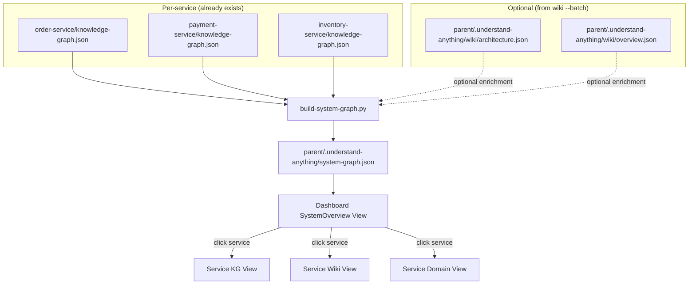

# System Graph: Microservice-Level Architecture Visualization

> Date: 2026-06-04
> Status: IMPLEMENTED — build-system-graph.py + SystemOverview React Flow (2026-06-05)

## Background

### Problem Statement

The Understand-Anything plugin currently offers two skills for microservice projects:

| Skill | Scope | Granularity | Output | Consumption |
|---|---|---|---|---|
| `/understand` | Single service | Code-level (file/function/class) | `knowledge-graph.json` (500–2000+ nodes/service) | Interactive force-graph in Dashboard |
| `/understand-wiki` | Multi-service (batch) | Domain-level (domain/flow/step) | Wiki JSON pages + parent architecture | Document navigation in WikiView |

**Gap identified:** There is no **system-level interactive visualization** that connects individual services into a navigable topology. Users who have indexed multiple services with `/understand` cannot see how they relate — they must run the heavier `wiki --batch` workflow or manually inspect each service's KG in isolation.

### Why NOT extend `/understand` with batch mode

Through systematic analysis (sequential thinking, 12-step evaluation), we concluded that adding multi-service batch indexing to `/understand` is **not cost-effective**:

1. **Scale explosion**: Merging full KGs across 10 services produces 5,000–20,000+ nodes — force-graph becomes unusable, cognitive overload defeats the purpose.
2. **Duplicate infrastructure**: Cross-service detection (RPC matching, Kafka topics, shared DB) already exists in `/understand-wiki`'s `cross-service-matcher.py`.
3. **Node ID collisions**: Multiple services may have identical relative paths (e.g., `file:src/main/java/com/.../ServiceImpl.java`), requiring namespace prefixes that would break all downstream consumers (layers, tour, dashboard, search).
4. **Maintenance burden**: Two parallel systems for cross-service detection doubles the maintenance cost.

### Optimal Solution

A **lightweight system graph** (`system-graph.json`) that:
- Extracts high-level summaries from each service's existing KG (~5–10 nodes/service)
- Optionally merges cross-service edges from wiki's `architecture.json` when available
- Total size: ~60 nodes + ~100 edges for a 10-service system (perfect for interactive visualization)
- Enables a natural drill-down path: **System → Service → Code**

### Key Design Decision: Reuse `endpoint` NodeType

RPC endpoint nodes (Dubbo, MOA, Feign, Kafka topics) **reuse the existing `endpoint` NodeType** defined in `types.ts`, distinguished by tags (`rpc-provider`, `rpc-consumer`, `kafka-topic` vs `api-handler`, `rest-endpoint`). This decision was made because:

1. `endpoint` is already a valid KG NodeType — no schema changes needed
2. Dashboard already renders `endpoint` nodes — no additional rendering code
3. `recover_rpc_mq_from_extraction()` in `merge-batch-graphs.py` (the `understand` skill) already generates synthetic nodes during the `understand` phase — they just need to be typed as `endpoint` instead of `class`
4. Tags provide sufficient semantic distinction between HTTP and RPC endpoints

---

## Architecture

### Data Flow



### Progressive Enhancement Strategy

The system graph works at multiple maturity levels:

| Level | Prerequisite | What you get |
|---|---|---|
| **Basic** | Each service has `knowledge-graph.json` | Service nodes + internal metrics (languages, frameworks, node count). No cross-service edges. |
| **Intermediate** | KGs have `provides_rpc` / `consumes_rpc` edges (via `rpcAnnotations` config) | Service nodes + RPC call edges between services. |
| **Full** | Wiki `--batch` has been run (architecture.json exists) | All of the above + enriched cross-service edges (Kafka events, shared DB, HTTP calls) + business flow grouping. |

This means users get value as soon as they've run `/understand` on each service — no need to wait for the heavy `wiki --batch` workflow.

---

## Component Design

### 1. `build-system-graph.py` — Generation Script

**Location:** `understand-anything-plugin/skills/understand-wiki/build-system-graph.py` (co-located with `cross-service-matcher.py` which it may invoke)

**Input:**
- `PROJECT_ROOT` — parent directory containing service subdirectories
- `--services` (optional) — explicit list of service names; defaults to auto-discovery

**Output:**
- `PROJECT_ROOT/.understand-anything/system-graph.json`

**Algorithm:**

```
1. Discover services:
   - Scan PROJECT_ROOT/* for directories with .understand-anything/knowledge-graph.json
   - Apply excludeServices filter from parent config.json (same as wiki)

2. For each service, extract from its KG:
   - project metadata (name, description, languages, frameworks)
   - Node count and edge count (for sizing)
   - All endpoint nodes (type: "endpoint") — includes both HTTP and RPC endpoints, distinguished by tags
   - All provides_rpc / consumes_rpc edges (generated by recover_rpc_mq_from_extraction during /understand)

3. Build system-graph nodes:
   - One "microservice" node per service
   - Optionally: top-N endpoint nodes per service (configurable, default 5)

4. Build system-graph edges:
   - "contains" edges: service → its endpoints
   - RPC edges: match consumes_rpc.interface to provides_rpc.interface across services

5. Optional wiki enrichment (if parent wiki exists):
   - Read architecture.json → merge crossServiceCalls as enriched edges
   - Read overview.json → enhance service descriptions

6. Write system-graph.json
```

**Schema:**

```json
{
  "version": "1.0.0",
  "generatedAt": "2026-06-04T12:00:00Z",
  "project": {
    "name": "My Microservice System",
    "description": "System description",
    "serviceCount": 5,
    "totalNodes": 2847,
    "totalEdges": 4521
  },
  "nodes": [
    {
      "id": "microservice:order-service",
      "type": "microservice",
      "name": "Order Service",
      "summary": "Handles order lifecycle management",
      "languages": ["Java"],
      "frameworks": ["Spring Boot"],
      "stats": { "nodes": 342, "edges": 567, "files": 48 },
      "kgPath": "order-service/.understand-anything/knowledge-graph.json",
      "wikiPath": "order-service/.understand-anything/wiki/",
      "domainPath": "order-service/.understand-anything/domain-graph.json"
    },
    {
      "id": "endpoint:order-service:POST /api/orders",
      "type": "endpoint",
      "name": "Create Order",
      "summary": "Creates a new order",
      "service": "order-service",
      "method": "POST",
      "path": "/api/orders"
    }
  ],
  "edges": [
    {
      "source": "microservice:order-service",
      "target": "endpoint:order-service:POST /api/orders",
      "type": "contains",
      "weight": 1.0
    },
    {
      "source": "microservice:order-service",
      "target": "microservice:payment-service",
      "type": "rpc_call",
      "weight": 0.8,
      "detail": {
        "interface": "PaymentFacade",
        "method": "createPayment()",
        "rpcType": "moa",
        "evidence": "kg-matched"
      }
    }
  ],
  "serviceIndex": {
    "order-service": {
      "hasKg": true,
      "hasWiki": true,
      "hasDomain": true,
      "kgCommit": "abc1234",
      "wikiCommit": "abc1234"
    }
  }
}
```

### 2. Dashboard SystemOverview View

**Location:** `packages/dashboard/src/components/SystemOverview.tsx`

**Design:**

- **Entry condition**: system-graph.json exists at parent level. Dashboard detects this via API endpoint.
- **Layout**: Force-directed graph (reuse existing `GraphView` component's rendering engine).
- **Microservice nodes**: Larger circles with service icon, name, tech stack badge. Color-coded by primary language.
- **Endpoint nodes**: Smaller dots grouped around their parent service (optional, togglable).
- **Cross-service edges**: Colored by type (RPC = blue, Event = green, SharedDB = orange). Animated direction indicators.
- **Interaction**:
  - Hover service → tooltip with stats (node count, languages, frameworks)
  - Click service → context menu: "Open KG View" / "Open Wiki" / "Open Domain Graph"
  - Click edge → tooltip with call detail (interface, method, type)
- **Sidebar**: Service list with health indicators (has KG?, has Wiki?, has Domain?)

**Minimal viable version** (Step 1):
- Service-level force graph only (no endpoint sub-nodes)
- Click-to-navigate to service KG
- Edge labels for cross-service calls

### 3. Integration Points

**3a. Wiki `--batch` post-hook:**

After `/understand-wiki --batch` Phase 3 completes, automatically invoke:
```bash
python3 "$SKILL_DIR/build-system-graph.py" "$PROJECT_ROOT"
```

This keeps the system graph in sync with the latest wiki cross-service analysis.

**3b. KG View cross-service awareness:**

When the KG Dashboard shows a service's graph:
- If the service has `consumes_rpc` edges pointing to external interfaces:
  - Render those edge targets with a "cross-service" badge (↗ icon)
  - On click, offer to navigate to the target service's KG view
- Data source: the service's own KG (already has `consumes_rpc` edges if `rpcAnnotations` is configured)

**3c. Navigation topology:**

```
Dashboard Tab Bar:
  [System] [KG] [Wiki] [Domain]
     │       │     │      │
     │       │     │      └─ Per-service domain flow graph
     │       │     └──────── Per-service Wiki pages (existing WikiView)
     │       └────────────── Per-service knowledge graph (existing KGView)
     └────────────────────── System-level service topology (NEW)
```

When user clicks a service node in System view, the KG/Wiki/Domain tabs automatically scope to that service.

---

## Rejected Alternatives

### A: Full KG merge with `--batch` mode on `/understand`

- 10 services × 500–2000 nodes = 5,000–20,000 node graph
- Force-graph rendering would freeze or become unreadable
- Node ID namespace collisions require breaking changes to core schema
- Duplicates wiki's cross-service detection infrastructure
- **Verdict: Not viable**

### B: Pure frontend transformation (no system-graph.json)

- Dashboard reads wiki's architecture.json + overview.json directly
- Transforms to nodes/edges on-the-fly in React
- **Problem**: Requires wiki `--batch` as prerequisite (heavy operation). Users who only ran `/understand` per-service get nothing.
- **Verdict: Acceptable but weaker than C (meta-graph)**

### C: New `/understand-system` skill with full LLM analysis

- Dispatches subagents to analyze cross-service relationships
- Runs its own matcher logic independently from wiki
- **Problem**: Duplicates wiki Phase 3's functionality; high token cost; maintenance burden
- **Verdict: Over-engineered**

---

## Implementation Plan (High-Level)

### Step 1: `build-system-graph.py` (~100 lines)
- Auto-discover services with KG
- Extract service metadata + endpoints + RPC edges
- Optional wiki enrichment
- Output system-graph.json
- **Estimated effort**: 1 day

### Step 2: Dashboard SystemOverview component
- New tab in Dashboard
- Service topology force-graph (reuse existing rendering)
- Click-to-navigate to per-service views
- **Estimated effort**: 2–3 days

### Step 3: Integration & Polish
- Wiki `--batch` post-hook
- KG view cross-service badges
- Tab scoping when navigating from System view
- **Estimated effort**: 1–2 days

**Total estimated effort**: 4–6 days

---

## Testing Strategy

1. **Unit tests**: `build-system-graph.py` with mock KG data (2–3 services, varied completeness)
2. **Integration test**: Generate system-graph from real test fixtures, validate schema
3. **Visual verification**: Dashboard rendering with 3, 5, 10, 20 service topologies
4. **Edge cases**:
   - Service with KG but no Wiki
   - Service with Wiki but stale KG
   - Empty parent directory (no services)
   - Single service (degenerate case — should still show)

---

## Success Criteria

1. User runs `/understand` on 3+ services → `build-system-graph.py` produces valid `system-graph.json`
2. Dashboard shows interactive service topology with correct cross-service edges
3. Clicking a service node navigates to its KG view
4. If wiki `--batch` has been run, edges are enriched with detailed call information
5. System graph with 10 services renders smoothly (< 1s paint, no jank)
