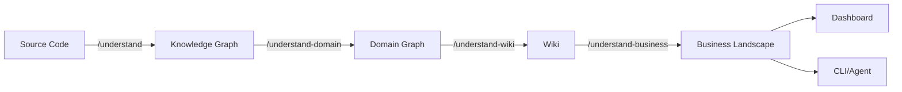
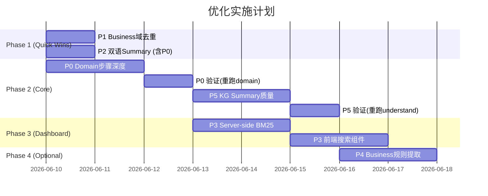

# Understand-Anything 生态全量优化设计

> Brainstorming Spec — 2026-06-09
> Status: DRAFT — Awaiting approval

---

## 1. 项目上下文

### 数据管线（严格串行依赖）



**依赖链**: 上游质量直接传导到所有下游。

### 已完成优化（本轮 understand-query 改进）

| 项目 | 状态 |
|------|------|
| Multi-keyword BM25 trace | ✅ |
| Domain-flow auto-fallback | ✅ |
| API 行数限制 200→500 | ✅ |
| kg --file --toc 模式 | ✅ |
| SKILL.md 泛化 | ✅ |
| 混合搜索（substring + BM25） | ✅ |

### 剩余问题清单

经过多轮 subagent 测试，确认以下问题需要解决：

| ID | 问题 | 根因位置 | 影响 |
|----|------|----------|------|
| P0 | Domain Flow 步骤模板化（全部是 Validate→Execute→Respond） | `agents/domain-flow-extractor.md` prompt | 全链路 |
| P1 | Business 域重复（11→应为8） | `skills/understand-business/assemble_landscape.py` | Business |
| P2 | Domain Flow 缺双语 summary | `agents/domain-flow-extractor.md` prompt | Agent CLI |
| P3 | Dashboard 无搜索 | `packages/dashboard/` | Dashboard |
| P4 | Business 规则不完整 | 生成逻辑 | Business |
| P5 | KG 节点 summary 质量差 | `/understand` 生成 | 全链路 |

---

## 2. P0: Domain Flow 步骤深度提升

### 当前问题

所有 flow 生成的步骤都是同一模板：
```
step:<flow>:validate → "Validate Input"
step:<flow>:execute → "Execute Business Logic"
step:<flow>:respond → "Build Response"
```
`lineRange` 一律 `[1, 100]`（默认占位值）。

### 根因分析

- `domain-flow-extractor.md` prompt 要求 "3-8 steps" 但未强制 minimum > 3
- Prompt Rule 6 写了 "Follow edge chains" 但表述过于简略
- KG subset 实际有 **74 条 calls 边**（以 closed-friend-relation 为例），调用链数据完整
- LLM 选择了最省力的模板路径

### 方案对比

| 方案 | 描述 | 优势 | 劣势 | 推荐 |
|------|------|------|------|------|
| A: Prompt 增强 | 修改 `domain-flow-extractor.md`，显式要求 trace calls edges | 零代码改动，快速验证 | LLM 仍可能偷懒 | ★★★★★ |
| B: 预处理脚本注入调用链骨架 | 在 Phase 4c 前新增 Python 脚本从 KG subset 提取 entry→calls 链，作为结构化输入 | 消除 LLM 自由度，确保准确 | 需新增脚本 + 修改 SKILL.md 管线 | ★★★★ |
| C: 后处理校验+重跑 | 生成后检测模板步骤，自动触发重跑 | 兜底保障 | 浪费 token、延长时间 | ★★ |

**推荐：A + B 组合**
- 先做 A（prompt 增强）验证效果
- 如果 LLM 仍产出模板步骤，追加 B（脚本注入骨架）

### 设计方案

#### A: Prompt 增强（`agents/domain-flow-extractor.md`）

修改重点：

1. **Task 部分新增强制要求**：
```markdown
## Step Extraction Rules (MANDATORY)

1. TRACE THE CALLS EDGES: For each flow's entryPoint function, follow the `calls` 
   edges in the provided edge list. Each called function is a candidate step.
2. MINIMUM 4 STEPS: Every flow MUST have at least 4 distinct steps. If you produce 
   fewer, you are doing it wrong — trace deeper.
3. NO TEMPLATE STEPS: The following generic step names are FORBIDDEN:
   - "Validate Input", "Execute Business Logic", "Build Response"
   - Use the actual method's business purpose (e.g., "检查亲密度阈值", "创建绑定记录")
4. ACCURATE lineRange: Each step's `lineRange` MUST come from the KG node's `lineRange` 
   field (not [1,100] or [0,0]).
5. DISTINCT filePath: Steps should reference different files when the call chain crosses 
   class boundaries. A flow that stays in one file is suspicious.
```

2. **Output schema 的 step 定义增强**：
```json
{
  "id": "step:<flow-name>:<specific-action>",
  "name": "<Specific Business Action in Chinese>",
  "summary": "<what this step does, derived from KG node summary + edge context>",
  "sourceNode": "<the KG node ID this step maps to>",
  "filePath": "<from KG node's filePath>",
  "lineRange": [123, 156]
}
```

3. **新增 Example section**，展示从 calls 边推导步骤的过程。

#### B: 调用链骨架预提取脚本

如果 A 效果不足，新增 `extract_call_chains.py`：

```python
# Input: domain-<name>.json
# Output: intermediate/call-chains-<name>.json

# For each endpoint/service node:
#   1. Find its outgoing 'calls' edges
#   2. Recursively follow calls edges (depth 3)
#   3. Output the chain as ordered list with each node's name, filePath, lineRange
```

将输出注入 flow-extractor agent 的 context 中，作为 "pre-computed call chains"。

### 期望效果

- 步骤数: 3(模板) → 5-8(真实)
- lineRange: [1,100](占位) → 真实行范围
- 步骤名: 英文通用 → 中文业务语义
- **下游自动受益**: Wiki 和 Business 不需要改动

### 努力估计

- A: 1-2小时（prompt 修改 + 重新生成验证）
- B: 3-4小时（脚本开发 + 集成 + 验证）

---

## 3. P1: Business 域去重

### 当前问题

`business-landscape/domains.json` 有 11 个域，"用户通用"、"用户关系"、"用户资料" 重复出现。

### 根因

`domain_matcher.py` 跨 facet 匹配时，两个 backend 服务内的同名域未合并。

### 方案对比

| 方案 | 描述 | 推荐 |
|------|------|------|
| A: 输出层去重 | `assemble_landscape.py` 最后按 name 去重合并 | ★★★★★ |
| B: Matcher 层防重 | 修改 `domain_matcher.py` 匹配逻辑 | ★★★ |

**推荐 A** — 最安全，不影响上游匹配逻辑。

### 设计方案

在 `assemble_landscape.py` 的 `write_domains()` 或等效输出函数中：
```python
seen = {}
for domain in matched_domains:
    key = domain["name"].strip().lower()
    if key in seen:
        # merge facets, interactions into existing
        seen[key]["facets"].extend(domain.get("facets", []))
        seen[key]["interactions"].extend(domain.get("interactions", []))
    else:
        seen[key] = domain
deduplicated = list(seen.values())
```

### 努力估计

低（1-2小时）

---

## 4. P2: Domain Flow 双语 Summary

### 当前问题

Domain Graph 的 flow `summary` 有时是中文有时是英文，不够统一。缺少中文 summary 的 flow 无法被 agent 的 BM25 中文搜索命中。

### 方案对比

| 方案 | 描述 | 推荐 |
|------|------|------|
| A: flow-extractor prompt 强制双语 | 要求每个 flow 同时输出 name(英文) + summary(中文) | ★★★★★ |
| B: 后处理翻译 | 生成后用 LLM 批量翻译缺失的中文 summary | ★★★ |
| C: CLI fallback 查 Wiki | CLI 搜索时同时查 wiki index 的中文描述 | ★★★★ |

**推荐 A**（与 P0 合并在同一次 prompt 修改中）

### 设计方案

在 `domain-flow-extractor.md` 增加：
```markdown
## Language Requirements

- `name`: English PascalCase or Title Case (e.g., "Create Family", "Bind Closed Friend")
- `summary`: Chinese, 1 sentence describing what the flow accomplishes in business terms
- `steps[].name`: Chinese, specific to the business action
- `steps[].summary`: Chinese, describing the step's purpose
```

### 努力估计

极低（与 P0 一并修改 prompt）

---

## 5. P3: Dashboard 搜索功能

### 当前问题

Dashboard 是纯浏览式，无全局搜索。

### 方案对比

| 方案 | 描述 | 优势 | 劣势 | 推荐 |
|------|------|------|------|------|
| A: 前端 Client-side 搜索 | 加载所有 index 到前端，JS 实现搜索 | 无 API 改动 | 大项目首屏慢 | ★★★ |
| B: Server-side BM25 API | 新增 `/api/search` endpoint | 高效、可复用 | 需 TS 实现 BM25 | ★★★★★ |
| C: CLI 侧搜索 proxy | Dashboard 调用 CLI 脚本 | 复用已有逻辑 | 跨语言调用复杂 | ★★ |

**推荐 B** — Server-side unified search API

### 设计方案

#### API 设计

```
GET /api/search?q=keyword&scope=all|wiki|kg|domain|business&limit=20&project=<project>
```

Response:
```json
{
  "results": [
    {
      "id": "function:...",
      "name": "checkIntimacyEnough",
      "type": "function",
      "layer": "kg",
      "summary": "检查亲密度是否达标",
      "score": 8.5,
      "filePath": "...",
      "lineRange": [45, 67]
    }
  ],
  "total": 42,
  "query": "亲密度"
}
```

#### 实现

1. TypeScript BM25 实现（移植 `ua_query.py` 中的算法）
2. 搜索范围：
   - KG: knowledge-graph.json 的 nodes
   - Wiki: wiki/index.json 的 entries
   - Domain: domain-graph.json 的 nodes
   - Business: business-landscape/domains.json
3. 统一 tokenizer（处理 camelCase、Chinese bigrams）

#### Dashboard 前端

- 顶部导航栏添加搜索输入框
- 实时搜索（debounce 300ms）
- 结果按 layer 分组，带类型 badge
- 点击跳转到对应 view

### 努力估计

中等偏高（4-6小时，前后端）

---

## 6. P4: KG → Business 规则自动提取

### 当前问题

Business 规则每域仅 2 条（如 "挚友需双方确认"），实际源码有 7+ 条约束。

### 方案对比

| 方案 | 描述 | 推荐 |
|------|------|------|
| A: KG 方法名启发式提取 | 从 KG 中找 check*/validate* 方法，LLM 转译为规则 | ★★★★ |
| B: 接受现状，Agent trace 自查 | Agent 通过 trace+source 已能定位规则 | ★★★ |
| C: Wiki flow step 衍生 | 从深化后的 Wiki 步骤中自动提取条件判断 | ★★★★★ |

**推荐 C**（在 P0 完成后，深化步骤中的条件判断可自动成为规则来源）

### 设计方案

- 优先级 DEFER — 等 P0 完成后，观察深化步骤是否自然暴露规则
- 如果 P0 效果好（步骤含 check/validate 等），可在 `/understand-business` 中加一步：提取 step name 中含 "校验"/"检查" 的步骤，转化为 businessRule

### 努力估计

中等（但依赖 P0 先完成）

---

## 7. P5: KG 节点 Summary 质量提升

### 当前问题

KG 节点 summary 多为模板文本：
- "方法 X，实现具体业务步骤"
- "类 Y，承载相关业务类型与行为"

这些 summary 对 BM25 搜索无贡献（无法匹配具体业务关键词）。

### 方案对比

| 方案 | 描述 | 推荐 |
|------|------|------|
| A: /understand prompt 强化 | 修改 file-analyzer agent prompt，要求具体 summary | ★★★★★ |
| B: 后处理 enrichment | 生成后批量用 LLM 重写 summary | ★★★ |
| C: 从源码注释提取 | 读取方法 Javadoc/注释作为 summary | ★★★★ |

**推荐 A + C 组合**
- A: 修改 prompt 要求具体描述
- C: 如果方法有 Javadoc，直接使用作为 summary

### 设计方案

修改 `agents/file-analyzer.md`（/understand 的核心分析 agent）：
```markdown
## Summary Requirements (MANDATORY)

Node summaries must answer "What does this do in business terms?" in one sentence.

FORBIDDEN generic summaries:
- "方法 X，实现具体业务步骤" ❌
- "类 Y，承载相关业务类型与行为" ❌

REQUIRED specific summaries:
- "检查用户亲密度是否达到挚友绑定阈值" ✓
- "管理挚友空间装扮素材的佩戴与过期状态" ✓

If the method has Javadoc/docstring, use its first sentence as the summary.
```

### 影响范围

修改 `/understand` 的 file-analyzer prompt 后，需要对目标项目重新运行 `/understand` 才能看到效果。所有下游（Domain、Wiki、Business）自动受益。

### 努力估计

- Prompt 修改: 1小时
- 重跑 KG: 取决于项目大小（ultron-relation ~30分钟）

---

## 8. 实施路线图



### 执行顺序与依赖

1. **P0 + P1 + P2 可并行**（P0 和 P2 合并为一次 prompt 修改）
2. **P5 依赖 P0 验证结果**（如果 P0 后 summary 仍差，需要同时修 P5）
3. **P3 独立**（可随时开始）
4. **P4 依赖 P0 + P5**（深化步骤 + 好 summary = 更好的规则提取）

---

## 9. 验证计划

| 优化项 | 验证方法 | 成功标准 |
|--------|---------|---------|
| P0 | 重跑 `/understand-domain`，检查 flows-*.json | 平均步骤数 ≥ 5，无模板名，lineRange 非 [1,100] |
| P1 | 重跑 `/understand-business`，检查 domains.json | 域数量 = unique count，无重复名称 |
| P2 | 检查 domain-graph.json | 所有 flow.summary 为中文，step.name 为中文 |
| P3 | Dashboard 手动测试 | 搜索"亲密度"返回 KG/Wiki/Domain 结果 |
| P4 | 检查 business rules | 每域 ≥ 5 条规则 |
| P5 | 检查 KG nodes summary | 无模板 summary，每条 ≥ 10 字且含业务关键词 |

---

## 10. Schema 同步与门禁校验

### Schema 同步原则

任何修改 JSON 输出结构的优化项，必须同步更新对应的 Zod schema：

| 优化项 | 涉及 JSON 结构 | Schema 位置 |
|--------|--------------|-------------|
| P0 | domain-graph.json (step 新增 sourceNode 字段) | `validate-graph.mjs` 中的 step schema |
| P2 | domain-graph.json (flow.summary 语言约束) | 同上 |
| P3 | 新增 API response | 新增 search response schema |
| P4 | business-landscape domains.json (rules 结构) | business schema |

### 门禁校验（Quality Gate）

每个优化项的输出必须经过自动化验证才算完成：

```
[Phase 4c] Flow Extraction → validate-graph.mjs (schema) → PASS/FAIL
[Phase 4d] Merge → validate-graph.mjs (complete) → PASS/FAIL
[Phase 5]  Save → domain-graph:complete validator → PASS/FAIL
```

新增门禁规则：
1. **P0 门禁**: 每个 flow 的 steps.length >= 4，无禁止的模板 name
2. **P2 门禁**: flow.summary 必须包含至少 2 个 CJK 字符
3. **P5 门禁**: node.summary 不匹配已知模板正则

### 实现方式

在 `validate-graph.mjs` 中新增以下校验逻辑：
```javascript
// P0: Step depth check
for (const flow of flows) {
  if (flow.steps.length < 4) warn(`Flow ${flow.id} has < 4 steps`)
  for (const step of flow.steps) {
    if (BANNED_NAMES.includes(step.name)) error(`Template step name: ${step.name}`)
    if (step.lineRange[0] === 1 && step.lineRange[1] === 100) warn(`Default lineRange`)
  }
}

// P2: Bilingual check
const CJK_RE = /[\u4e00-\u9fff]/
for (const flow of flows) {
  if (!CJK_RE.test(flow.summary)) warn(`Flow ${flow.id} summary lacks Chinese`)
}
```

---

## 11. 风险与缓解

| 风险 | 概率 | 缓解 |
|------|------|------|
| P0 prompt 改后 LLM 仍生成模板步骤 | 中 | 追加方案 B（调用链骨架脚本注入） |
| P5 重跑 KG 成本过高 | 低 | 增量模式：仅重跑 summary 质量差的 batch |
| P3 Dashboard 搜索性能差 | 低 | 预建索引，启动时加载到内存 |
| P0 深化步骤导致 domain-graph.json 过大 | 低 | 步骤上限 8（已在 prompt 中限制） |
| Schema 变更破坏现有数据兼容性 | 中 | 新字段使用 optional，旧数据自动通过 |
