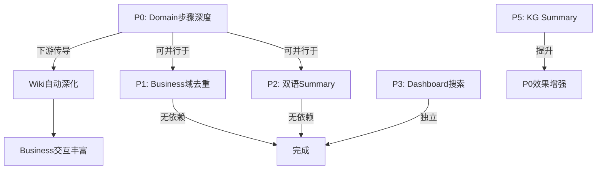

# Understand-Anything 生态优化提案

> 目标：同时提升 Dashboard（人类用户）和 CLI/Agent（AI Agent）的体验质量

## 背景

当前生态数据管线（严格顺序依赖）：
```
Source Code
  ↓ /understand
KG (源码级关系图: 类、方法、调用、RPC)
  ↓ /understand-domain (依赖 KG)
Domain Graph (业务流程图、中英文 Flow)
  ↓ /understand-wiki (依赖 KG + Domain Graph)
Wiki (服务文档、端点、Flow步骤、源码引用)
  ↓ /understand-business (依赖 Server Wiki + Client Wiki + system.json)
Business Landscape (跨端业务域、交互文档、业务规则)
  ↓
Dashboard (人类浏览)  +  CLI/API (Agent查询)
```

> **关键依赖链**: KG → Domain → Wiki → Business（严格串行，上游质量直接传导到下游）

经过多轮 subagent 测试验证，发现以下核心问题：

| 问题 | 影响 Dashboard | 影响 Agent |
|------|:---:|:---:|
| Wiki Flow 步骤浅（2步 vs 实际5-8步） | ★★★★★ | ★★★ |
| Business 域重复（11个含重复，实际8个） | ★★★★ | ★★ |
| Domain Flow 缺少双语 summary | ★★★ | ★★★★ |
| Dashboard 无搜索功能 | ★★★★★ | — |
| Business 规则不完整（2条 vs 源码7+条） | ★★★ | ★★★★ |
| KG 节点 summary 质量参差 | ★★ | ★★★★ |

---

## P0: Domain Flow 步骤深度提升（根因修正）

### 问题

当前 **所有 Flow 的步骤都是模板化的**，无论功能如何复杂，一律生成 3 步：

```json
// domain-graph.json (ultron-relation)
"step:bind:validate" → "Validate Input"
"step:bind:execute" → "Execute Business Logic"  
"step:bind:respond" → "Build Response"
```

Wiki 忠实继承 Domain 的步骤（因为 Wiki 依赖 Domain），Business 则基于 Wiki 生成交互文档。
**质量退化链**: Domain(模板3步) → Wiki(继承3步) → Business(浅交互文档)

**实际期望（基于源码验证）：**
- "建立挚友关系" → 校验亲密度阈值 → 检查现有关系 → 创建绑定记录 → 发布Kafka事件 → 触发通知 (5步)
- "亲密度增加" → 送礼回调 → 资格校验 → 计算增量 → Redis原子写入 → 等级升级判定 → 发布任务事件 (6步)

### 根因

`/understand-domain` 生成 flow steps 时未利用 KG 的 **方法调用链** (calls edges)，而是对每个 flow 统一套用 Validate → Execute → Respond 的通用模板。
同时 `lineRange: [1, 100]` 也是默认值而非真实定位。

### 方案

**修改 `/understand-domain` 的 Step 生成逻辑（KG 调用链注入）**

1. **提取调用链**: 从 KG 中找到 Flow 入口方法 (entryPoint)，遍历其 `calls` 边（深度 2-3），构建实际方法调用序列
2. **构建骨架**: 将调用序列转换为结构化步骤骨架（每个被调用方法 = 1个潜在步骤）
3. **LLM 精化**: 将骨架提供给 LLM，要求：
   - 合并过于细碎的步骤（如 getter/setter）
   - 保留有业务意义的步骤
   - 为每步生成准确的中文 description
   - 定位每步的真实 `filePath` + `lineRange`

```
输入 KG 调用链:
  ClosedFriendWebServiceImpl.bindClosedFriend()
    → checkIntimacy()        [IntimacyChecker.java:45-67]
    → checkExistingRelation() [ClosedFriendService.java:88-102]
    → createRecord()         [ClosedFriendService.java:110-145]
    → publishEvent()         [KafkaProducer.java:23-35]

输出 Domain Steps:
  step1: "校验亲密度阈值" → IntimacyChecker.java:45-67
  step2: "检查现有关系状态" → ClosedFriendService.java:88-102
  step3: "创建挚友绑定记录" → ClosedFriendService.java:110-145
  step4: "发布关系变更事件" → KafkaProducer.java:23-35
```

### 涉及文件

- `skills/understand-domain/` 中的 Flow/Step 生成逻辑（LLM prompt + KG 数据读取）
- 下游 Wiki 和 Business 会**自动受益**（无需额外修改）

### 期望效果

- Flow 步骤数: 3(模板) → 4-8(真实)
- 每步 sourceRef 精确到方法级 lineRange
- Dashboard 流程图展示真实调用链
- Wiki 自动继承深度步骤
- Business 交互文档自动丰富
- Agent trace 的 domain-flow fallback 返回更有意义的 flow 信息

### 努力估计

中-高（需修改 domain skill 的核心生成逻辑 + 验证下游传导效果）

### 依赖

无前置依赖。但下游 P1(Business去重) 和 P2(双语Summary) 可并行执行。

---

## P1: Business 域去重

### 问题

`business-landscape/domains.json` 中有 11 个域，但 "用户通用"、"用户关系"、"用户资料" 各出现两次。

### 根因

`domain_matcher.py` 匹配时，两个 backend 服务（ultron-basic-user, ultron-relation）可能都有同名域，导致重复产生。

### 方案

修改 `assemble_landscape.py`：
1. 在输出 `domains.json` 前，按 domain name 去重
2. 当多条目同名时，合并 facets 和 interactions
3. 保留最完整的那条记录作为主记录

### 涉及文件

- `skills/understand-business/assemble_landscape.py`

### 期望效果

- 域数量: 11 → ~8 (去除重复)
- Dashboard 视图更清晰
- Agent `business --list` 结果更精确

### 努力估计

低（1-2小时，单文件修改）

---

## P2: Domain Flow 双语 Summary

### 问题

Domain Graph 的 Flow 节点有英文 name（如 "Bind Closed Friend"）但不一定有中文 summary。`trace` 的 auto-fallback 依赖 BM25 匹配 flow summary 中的中文内容。缺少中文 summary 的 flow 无法被中文关键词发现。

### 方案

在 `/understand-domain` 生成时，确保每个 Flow 节点包含：
- `name`: 英文（现有）
- `summary`: 中文业务描述（新增/增强）

两种实现路径：
1. **LLM 翻译**: 生成 domain graph 时，LLM 自动为每个 flow 添加中文 summary
2. **Wiki 交叉引用**: 从 wiki 中查找同名 flow 的中文描述，注入到 domain graph

### 涉及文件

- `skills/understand-domain/` 中的 Flow 生成逻辑
- 或 domain graph 后处理脚本

### 期望效果

- 中文 keyword 命中率: 当前约 60% → 目标 95%+
- Agent 的 trace auto-fallback 对所有功能都有效
- Dashboard 流程图显示中文标签

### 努力估计

中等

---

## P3: Dashboard 搜索功能

### 问题

Dashboard 是纯浏览模式，用户无法搜索。必须手动点击导航。

### 方案

**Server-side 统一搜索 API**

新增 API endpoint：
```
GET /api/search?q=keyword&scope=all|wiki|kg|domain|business&limit=20
```

实现：
1. 将 Python CLI 的 BM25 算法移植为 TypeScript 版
2. 搜索范围覆盖所有数据层（Wiki pages、KG nodes、Domain flows、Business domains）
3. 返回带类型标注和来源的排序结果

Dashboard 前端：
- 添加全局搜索框（顶部导航栏）
- 搜索结果按层分组展示
- 点击结果跳转到对应视图

### 涉及文件

- `packages/dashboard/src/api/handlers/` 新增 `search.ts`
- `packages/dashboard/src/components/` 新增搜索组件
- 前端路由/导航更新

### 期望效果

- 用户可直接搜索任何概念，秒级定位
- 替代手动导航，效率提升 5-10x
- Agent CLI 也可选择使用 server-side search（减少数据传输）

### 努力估计

中等偏高（前后端同时改动）

---

## P4: KG → Business 规则自动提取（DEFER）

### 问题

Business 规则仅 2 条/域，而源码实际有 7+ 条约束（如亲密度的性别检查、特殊账号排除、频控等）。

### 方案（概念）

分析 KG 中 `check*`、`validate*`、`has*` 等方法节点：
1. 提取条件逻辑
2. LLM 转译为人类可读的业务规则
3. 写入 business-landscape

### 决策

**DEFER** — 当前 Agent 通过 trace+source 已能找到完整规则。此优化主要服务 Dashboard 展示完整性，ROI 相对较低。待 P0-P3 完成后再评估。

---

## P5: KG 节点 Summary 质量

### 问题

部分 KG 节点的 summary 为空或过于泛化，影响 BM25 搜索精度。

### 方案

在 `/understand` KG 生成时，强化 LLM prompt 要求每个节点必须有有意义的 1 句话 summary：
- Function: "这个方法做什么"
- Class: "这个类负责什么"
- Interface: "这个接口定义什么契约"

### 期望效果

- BM25 搜索准确率提升
- Dashboard tooltip 信息更有用
- 减少 agent 需要读源码才能理解节点用途的情况

### 努力估计

中等（需修改 /understand 的 prompt 和验证）

---

## 实施路线图

```
Phase 1 (Quick Wins — 可并行):
  ├─ P1: Business 域去重 [1-2h, assemble_landscape.py]
  └─ P2: Domain Flow 双语 Summary [中等, domain skill prompt]

Phase 2 (Core Quality — 最高优先级):
  └─ P0: Domain Flow 步骤深度 [中-高, domain skill 核心逻辑]
       ↓ 下游自动受益
       Wiki 步骤深度 ✓
       Business 交互文档 ✓

Phase 3 (Dashboard UX):
  └─ P3: Dashboard 搜索功能 [中等偏高, 前后端]

Phase 4 (Polish):
  ├─ P5: KG Summary 质量 [中等, understand skill prompt]
  └─ P4: KG→Business 规则提取 [高, 视需求]
```

### 依赖关系图



## 已完成的优化（本轮）

| 优化项 | 状态 |
|--------|------|
| Multi-keyword parallel BM25 trace | ✅ |
| Domain-flow auto-fallback + specificity | ✅ |
| API 行数限制 200→500 | ✅ |
| trace source 字符截断移除 | ✅ |
| SKILL.md 批量读取指导 | ✅ |
| SKILL.md 泛化（移除硬编码映射） | ✅ |
| SKILL.md Step 0 多关键词指导 | ✅ |
| kg --file --toc 模式 | ✅ |
| _score_node_relevance 精细化 | ✅ |
| 混合搜索（substring + BM25） | ✅ |
